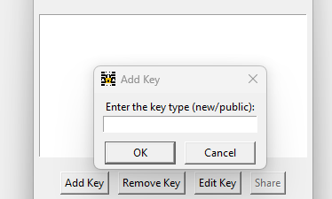
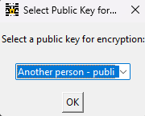

[If you can see this, you are reading this file WRONG!]: #
[Go to https://stackedit.io/app# and copy this entire file in.]: # 

# Instructions for Installing

## Step 1: Install python
### On Computers With Software Center and Python in it (i.e. school computers)
Open Software Center by pressing the `⊞ Win` key, then typeing `Software Center`. Search `python`, and install it.
### On computers where you can install python
Download python from [here](https://www.python.org/downloads/). Follow the directions on the website.
## Step 2: Setup Python Files and Libaries
Open command prompt by pressing `⊞ Win` + `R` and typing `cmd`. Navigate to the folder where you downloaded this with `cd C:\the\path\where\this\is\installed`. 
Run the python setup program with the command `python ezencrypt.py`, and wait for it to complete.
## Step 3: Run the Program!
### Option a) Run with python
Follow the steps in step 2 to open a command prompt to the same directory, then run the command `cd ezencrypt`. To run the program, run the command `python ezencrypt.py`.
### Option b) Run with executable
Follow the steps in step 2 to open a cocmmand prompt to the same directory, then run the command `ezencrypt.exe`.

# Instructions for usage

If you are confused about private keys and public keys, go to the `About` section.

## Key Generation
Click `Manage Keys` and press `Add Key`. You will be prompted to enter a name. This name will help you identify the key. You will then see the following dialoug box:

Entering `new` will generate a new private-public key, requiring a password (DO NOT FORGET THE PASSWORD). Entering `public` will allow adding other people's keys.
## Key Removal
Select the key and press remove.
## Key Sharing
Select a public key and press share. Give this key to anyone so they can encrypt messages to you/
To add a key that someone is gave you (make sure you trust the key!), click `Add Key` and put the key type `public`. Enter the key given to you. 
## Encryption
Click `Encrypt Message` and enter your message.

Choose the <b>public key</b> of the person you want to send it to. Then, choose <b>your private key</b> to sign the key. Enter your password that you used to create the private key.
It will then spit out the encrypted message which you can send to the person.
## Decryption
Click `Decrypt Message` and enter the encrypted message. Select `your private key` and enter the password for the key. You will then get either:
1. A message saying `This message is verified ✅ to come from the sender <key name>`. This means that you can be sure that the message was sent from someone with the corrosponding private key of the key name.
2. A message saying `This message is not verified to come from any of your senders`. This means someone might be impersonating whoever you think send you it.
## Optional Master Key
You can optionaly opt to use more security by encrypting your key files while not in use. To do so, click `Add master key`, and enter a master key to protect your data.
The window will then restart, prompting for the master key.
### WARNING: If you loose the master key, your data will be lost forever.
## Master Key Removal
Press `Remove Master Key` and enter the confermation code. To change the master key, press `Save all changes/Change master key` and enter the new master key.

# About

## Encryption mechanism (read this if you don't understand some of the terms)
This program uses an asymetric RSA key system combined with a symmetric key system. Anyone with your <b>public</b> RSA key can encrypt messages to you, but only people with your <b>private</b> RSA key can decrypt messages.
To ensure that the messges come from someone you trust, message signing is incorperated. Only you can sign messages with your <b>privte</b> key, but anyone can check it was you with your <b>public</b> key.
